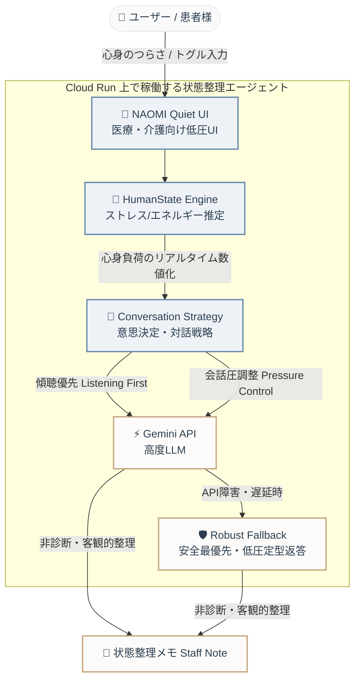

# 🌿 NAOMI (Phase 4 / MANA)
> **人の“支える”を支えるAI — Human-Adaptive Listening Agent**
> 
> *Google Cloud × AI Agent Hackathon 提出リポジトリ*

---

## ⚖️ 審査員へ：普通のAIチャットボットとの圧倒的な違い

一般的なAIチャットボットは、ユーザーの限界状態を考慮せず「すぐ解決策（ToDo）や正論を提示」し、会話圧（情報量や認知的プレッシャー）を高めてしまいます。
**NAOMIは、相手のストレスや精神的エネルギーを推定し、会話の圧力（Pressure Level）を自動調整しながらそっと状態を整理する「状態整理支援エージェント」です。**

*   **👂 Listening First (傾聴最優先)**: まずは低い会話圧で受け止め、心身に小さな余白を作る「Cognitive Relief（認知的解放）」を提供。
*   **🌿 Pressure Control (会話圧の自動抑制)**: 元気がない時や眠気がある時には、言葉数を極限まで減らし、トーンを低圧化。
*   **♿ Accessibility (AAC / やさしい入力)**: 巨大文字、ボタン選択、話したくない時の無応答対応など、身体的・精神的に対話が難しい方に向けた高度な入力補助。
*   **🛡️ 非診断プロトコル & Robust Fallback**: 医療診断は一切行わず客観的整理のみを支援。Gemini APIが未設定・タイムアウト時でも100%機能するローカルフォールバック機構を内蔵。

---

## 🧠 NAOMIを支える5大エージェント機能

1. **HumanState Engine (状態推定)**
   ユーザーのわずかな言葉の乱れや入力されたテキストから、**8次元の定量パラメータ**（ストレス、孤独感、眠気、エネルギー、傾聴欲求、アドバイス欲求、安心欲求、身体的不調）をリアルタイムに自律推定します。
2. **Mode Selection (接し方選択)**
   推定された心身状態に基づき、AIの「接し方の役割（モード）」を5つ（静かな見守り、傾聴最優先、穏やかな整理、静かな伴走、低圧応対）へ自律的に切り替えます。
3. **Pressure Control (会話圧制御)**
   選択されたモードに応じ、会話の「返答密度（ speech_density ）」、「沈黙/ポーズの長さ（ pause_length ）」、「解決策提示のタイミング（ advice_mode ）」などの対話戦略をダイナミックに変化させます。
4. **Intake Manager (自律問診とレッドフラグ検知)**
   15ステップの丁寧な対話を通じて状況をヒアリングします。対話中に「息苦しい」「痛い」などの危険ワードを監視し、緊急度に応じた**レッドフラグ**を検知すると、即座に安全ガードレール（低圧・安全最優先ポリシー）を作動させます。
5. **Staff Note / Handoff Note (状態整理メモ)**
   対話の裏側で、ユーザーが自分の状態を客観的に見つめ直すためのメモや、医療従事者・ご家族へ状況を的確に伝えるための「申し送りサマリー」を完全に自動で組み立てて出力します。

---

## 🗺️ アーキテクチャ構成

### 1. システムコンセプト (Quiet Luxury Visual)
ハッカソン向けにデザインされた、上質でノイズのないビジュアル・アーキテクチャです。


### 2. コア・システムフロー



---

## 🚀 起動・デプロイ方法 (第三者向け)

### 1. ローカルでのクイック起動

#### 📦 動作要件
* **Python**: `3.9` 〜 `3.11` 推奨
* **OS**: Windows, macOS, Linux

#### 🏗️ セットアップ手順
1. **リポジトリのクローンと移動**
   ```bash
   git clone <GitHubリポジトリURL>
   cd NAOMI_Project
   ```
2. **仮想環境の作成と有効化**
   ```bash
   # Windows
   python -m venv venv
   .\venv\Scripts\activate

   # macOS / Linux
   python3 -m venv venv
   source venv/bin/activate
   ```
3. **依存パッケージのインストール**
   ```bash
   pip install --upgrade pip
   pip install -r requirements.txt
   ```
4. **環境変数の設定 (`.env`)**
   プロジェクトルートに `.env` ファイルを作成し、Gemini APIキーを設定します。
   ```env
   GEMINI_API_KEY=your_actual_gemini_api_key_here
   ```
   *※ `GEMINI_API_KEY`（または `GOOGLE_API_KEY`）が未設定の場合でも、NAOMIは自動的に内蔵された **Robust Fallback（ローカル感情適応ルールベース）** に切り替わり、すべての画面遷移、状態推定、対話トーン調整、Staff Note生成機能を100%維持して起動します。*
5. **アプリケーションの起動**
   ```bash
   streamlit run frontend/streamlit_app.py
   ```
   ブラウザで `http://localhost:8501` に自動アクセスします。

### 2. Google Cloud Run へのデプロイ
Google Cloud CLI が設定済みの環境から、プロジェクトルートで次のコマンドを実行するだけでデプロイが完了します（`PORT` 環境変数およびコンテナ化に自動対応しています）。

```bash
gcloud run deploy naomi-project \
  --source . \
  --region asia-northeast1 \
  --allow-unauthenticated \
  --set-env-vars GEMINI_API_KEY=YOUR_GEMINI_API_KEY
```

For a fallback-only demo without Gemini, omit `--set-env-vars`. NAOMI will still start and use the local robust fallback behavior.

Recommended hackathon deployment command:

```bash
gcloud run deploy naomi \
  --source . \
  --region asia-northeast1 \
  --allow-unauthenticated \
  --memory 1Gi \
  --cpu 1 \
  --max-instances 2
```

If `asia-northeast1` is unavailable, `us-central1` is also suitable for the demo.

### 3. Docker / Cloud Run container notes

The included `Dockerfile` runs Streamlit on the Cloud Run-provided `PORT` and binds to `0.0.0.0`.

```bash
docker build -t naomi-cloudrun .
docker run --rm -p 8080:8080 -e PORT=8080 naomi-cloudrun
```

Open `http://localhost:8080` and confirm that the home screen, Interactive Demo, State Organization, and Health State Memo render without a Gemini API key.

### 4. Required environment variables

| Name | Required | Purpose |
| --- | --- | --- |
| `PORT` | Cloud Run provides it | Streamlit server port. Defaults to `8080` in Docker. |
| `GEMINI_API_KEY` | No | Preferred Gemini API key variable. |
| `GOOGLE_API_KEY` | No | Compatible Gemini API key variable. |

No API key is required for basic operation. When neither Gemini key is configured, NAOMI keeps the demo working through local fallback logic.

---

## 📄 ライセンス (LICENSE)

本プロジェクトは **MIT License** の下で公開されています。詳細な許諾条件については [LICENSE](LICENSE) ファイルをご覧ください。

---

## 🛡️ 安全に関する免責事項
*   NAOMIは医療診断を行うAIではなく、医師や専門家への相談を円滑にするための「対話・状態整理支援ツール」です。
*   状態推定や出力される「状態整理メモ (Staff Note)」は客観的整理のための目安であり、病名の断定や特定の症状を確定診断するものではありません。
*   緊急を要する心身の不調や、深刻な精神的苦痛を感じている場合は、速やかに専門の医療機関や公的相談窓口に直接ご相談ください。

## Required Hackathon Integrations

This project uses the required hackathon runtime integrations:
- Gemini is called in `agent/gemini_brain.py` through `generate_content()`.
- Google Cloud Agent Engine is called in `agent/agent_engine_client.py` when `NAOMI_AGENT_ENGINE_RESOURCE` is configured.
- Arize MCP Server is called in `agent/arize_mcp_client.py` through `ClientSession.call_tool(...)`.
- The runtime status is visible in the Streamlit debug expander.

Partner Track: Arize

Agent Builder option: Google Cloud Agent Engine

Gemini:
- file: `agent/gemini_brain.py`
- runtime call: `google.generativeai.GenerativeModel(...).generate_content(...)`
- env: `GEMINI_API_KEY` or `GOOGLE_API_KEY`

Agent Engine:
- file: `agent/agent_engine_app.py`
- file: `agent/agent_engine_client.py`
- deploy script: `scripts/deploy_agent_engine.py`
- runtime env: `NAOMI_AGENT_ENGINE_RESOURCE`
- local fallback: if `NAOMI_AGENT_ENGINE_RESOURCE` is not set, NAOMI continues through the local `NaomiAgentCore`.

Arize MCP:
- file: `agent/arize_mcp_client.py`
- runtime call: `ClientSession.call_tool(...)`
- runtime env: `ARIZE_MCP_COMMAND`, optional `ARIZE_MCP_ARGS_JSON`, `ARIZE_MCP_TOOL_NAME`, `ARIZE_API_KEY`, `ARIZE_SPACE_ID`
- if `ARIZE_MCP_COMMAND` is not set, the MCP integration reports `disabled` and the app keeps running.
- official Phoenix MCP package: `@arizeai/phoenix-mcp@latest`
- Cloud Run example: `ARIZE_MCP_COMMAND=npx` and `ARIZE_MCP_ARGS_JSON=["-y","@arizeai/phoenix-mcp@latest","--baseUrl","https://app.phoenix.arize.com","--apiKey","YOUR_PHOENIX_API_KEY"]`
- Windows local testing may need `ARIZE_MCP_COMMAND=npx.cmd` because PowerShell can block `npx.ps1`.

Phoenix / OpenTelemetry:
- file: `agent/arize_tracing.py`
- runtime env: `PHOENIX_COLLECTOR_ENDPOINT`
- this is additional observability and does not replace the required Arize MCP `call_tool` runtime path.

Unified runtime entry:
- file: `agent/hackathon_integrations.py`
- UI integration: `frontend/streamlit_app.py`
- runtime flag: set `ENABLE_HACKATHON_INTEGRATIONS=true` for the judging deployment.
- the Streamlit UI includes a collapsed `Hackathon runtime integrations` expander showing Gemini, Agent Engine, Arize MCP, Phoenix/OpenTelemetry, and Trace ID status.

Verification:

```bash
python scripts/verify_hackathon_integrations.py --offline
python scripts/verify_hackathon_integrations.py --online
```

Local development works without Agent Engine or Arize environment variables. For the judging Cloud Run deployment, set `ENABLE_HACKATHON_INTEGRATIONS=true`, put the Agent Engine resource name in `NAOMI_AGENT_ENGINE_RESOURCE`, and put the Arize MCP server command in `ARIZE_MCP_COMMAND`. Do not commit API keys or secrets to GitHub; use Cloud Run secrets or environment variables.

The included Cloud Run `Dockerfile` installs Node.js and npm so an Arize MCP command that uses `npx` can start inside the container. If your Arize MCP server uses a different CLI, add that runtime dependency before deploying.

Deploy Agent Engine:

```bash
set GOOGLE_CLOUD_PROJECT=YOUR_PROJECT
set GOOGLE_CLOUD_LOCATION=us-central1
set VERTEX_AI_STAGING_BUCKET=gs://YOUR_BUCKET
python scripts/deploy_agent_engine.py
```

The script prints the resource name. Set that value as `NAOMI_AGENT_ENGINE_RESOURCE`.

Judging Cloud Run example:

```bash
gcloud run deploy naomi \
  --source . \
  --region us-central1 \
  --allow-unauthenticated \
  --memory 1Gi \
  --cpu 1 \
  --set-env-vars ENABLE_HACKATHON_INTEGRATIONS=true,GOOGLE_CLOUD_PROJECT=YOUR_PROJECT,GOOGLE_CLOUD_LOCATION=us-central1,NAOMI_AGENT_ENGINE_RESOURCE=YOUR_AGENT_ENGINE_RESOURCE,ARIZE_MCP_COMMAND=YOUR_ARIZE_MCP_COMMAND,ARIZE_MCP_TOOL_NAME=YOUR_ARIZE_MCP_TOOL
```

Use `--set-secrets` or Cloud Run secret-backed environment variables for real API keys such as `GEMINI_API_KEY`, `ARIZE_API_KEY`, and any Phoenix credentials.


