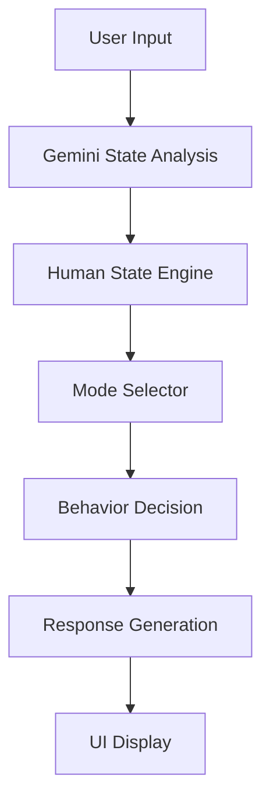

# NAOMI Project MVP System Design

## 1. プロジェクト概要

### 目的
DevOps × AI Agent Hackathon向けに開発される「人間状態に適応して接し方を変えるAI Agent」のプロトタイプ構築。

### 基本方針
単にユーザーの質問に対して情報を「返答するAI」ではなく、ユーザーの心理的・身体的状態を推測し、それに応じて「接し方（空気感・間合い・テンポ）を変えるAI」を目指します。

### モード概要
ユーザーの状態に合わせ、以下の3つの主要モードをシームレスに切り替えます。
*   **Sleep Mode**: 就寝前や極度の疲労時に寄り添うモード
*   **Care Mode**: 精神的なサポートや癒やしを提供するモード
*   **Snack Mode**: 軽い雑談や日常的な会話を楽しむモード

---

## 2. MVPスコープ

今回のMVP（Minimum Viable Product）では、コアとなる「適応的振る舞いの変化」の検証に特化し、以下の機能のみを実装します。

### 実装対象
*   テキスト入力インターフェース
*   Geminiによるユーザー状態推定（文脈・感情分析）
*   Human State Engine（状態値の管理・遷移）
*   Mode Selector（最適なモードの選択）
*   Response Generator（状態を反映したテキスト生成）
*   Agent判断ログ表示（内部パラメータやモード遷移の可視化）
*   Streamlit UI（簡易フロントエンド）

### 対象外（Non-Scope）
*重要:* MVPの迅速な検証のため、以下の機能は実装範囲外とします。
*   ASMRの長時間音声生成
*   Live2D等のアバター表示・アニメーション
*   動画の自動生成機能
*   SNS等の外部プラットフォーム連携

---

## 3. Human State Engine

ユーザーの現在の状態を定量化し、エージェントの振る舞いを決定するためのコアエンジンです。以下の4つの主要パラメーター（0.0〜1.0の範囲）で状態を管理します。

*   **stress (ストレス度)**
    *   *影響:* 高い値になると、Agentの `speech_density`（会話密度）が低下し、ユーザーに負担をかけないようになります。
*   **loneliness (孤独感)**
    *   *影響:* 高い値になると、Agentはより高い共感を示し、安心感（`atmosphere`）を増加させた応答を行います。
*   **sleepiness (眠気)**
    *   *影響:* 高い値になると、全体の会話のテンポが減速し、`pause_length`（間）が長くなります。
*   **energy (活力)**
    *   *影響:* 高い値になると、会話が活発化し、よりテンポの良いインタラクションになります。

---

## 4. Agent Behavior Parameters

Human State Engineの出力に基づき、Agentが自身の出力（テキスト生成や擬似的な発話スタイル）を調整するための内部パラメータです。

*   **speech_density**: 発話量や情報量の密度。高いほど多弁になり、低いほどシンプルで静かな応答になります。
*   **pause_length**: 文脈の間や応答までの休止時間。
*   **tone**: 声色や文面の調子（落ち着き、明るさ、優しさなど）。
*   **atmosphere**: 全体的な空気感や空間演出（BGMやSEの想定を含む）。

---

## 5. Mode Definitions

Agentは推測された状態に基づき、以下のいずれかのモードに遷移し、最適化されたBehavior Parametersを適用します。

### Sleep Mode
*   **特徴**: 静か
*   **間合い**: 間長め (`pause_length` 大)
*   **環境音想定**: 雨音などのホワイトノイズ
*   **トーン**: 囁き寄り

### Care Mode
*   **特徴**: 安心感
*   **テンポ**: ゆっくり (`speech_density` 低〜中)
*   **スタンス**: 聞き役
*   **共感度**: 高共感

### Snack Mode
*   **特徴**: 雑談
*   **スタンス**: 相槌多め
*   **トーン**: 少し明るい
*   **テンポ**: やや速め (`energy` 高状態に適応)

---

## 6. Processing Flow

ユーザーの入力からエージェントの応答生成までの処理フローは以下の通りです。

1.  **User Input**: ユーザーからのテキストメッセージを受信。
2.  **Gemini State Analysis**: LLM（Gemini）を用いて入力テキストから裏側にある感情や状態を推定。
3.  **Human State Engine**: 推定結果を基に内部の状態値（stress, loneliness等）を更新。
4.  **Mode Selector**: 更新された状態値から最適なモード（Sleep/Care/Snack）を選択。
5.  **Behavior Decision**: 選択されたモードに合わせ、Agent Behavior Parametersを決定。
6.  **Response Generation**: 決定されたパラメータ（間、トーン、密度など）をプロンプトに反映し、最終的な応答テキストを生成。
7.  **UI Display**: ユーザーへの応答と合わせ、Agentの内部判断ログ（状態値やモード遷移）を画面上に可視化。

---

## 7. Technical Stack

Hackathon期間内での迅速なプロトタイピングとデプロイを実現するため、以下のスタックを採用します。

*   **Frontend**: Streamlit (状態の可視化とチャットUIの高速開発用)
*   **Backend**: FastAPI (ロジックとAPIエンドポイントの提供)
*   **AI**: Gemini API (状態推定および応答生成用LLM)
*   **Deploy**: Cloud Run (コンテナベースのサーバーレスデプロイ)

---

## 8. Important Design Philosophy

NAOMI Projectを開発する上で、以下の設計思想を常に最優先事項とします。

*   **「情報提供AI」ではない**: 知識や正解を返すことよりも、ユーザーの心に寄り添うことを目的とする。
*   **「空気感適応AI」**: ユーザーが発する言葉そのものだけでなく、その裏にある状態を読み取り、全体の空気感を合わせる。
*   **「安心感インターフェース」**: 触れるだけで緊張が解け、自己受容を促すような体験を提供する。
*   **「AI Companion」**: 単なるツールではなく、ユーザーの隣に存在し、共に時間を過ごす伴走者としてのAIを目指す。

---

## 9. Future Roadmap (VOICE Chat Integration)

NAOMI Projectの最終目標は「VOICEチャット（音声対話）への対応」です。MVP段階からAgent CoreロジックをI/Oから完全に分離して設計しており、以下のステップで拡張を進めます。

*   **Step 1: Text Chat MVP** (現在)
    *   テキスト入出力ベースで状態遷移・応答生成のAgent Coreを検証。
*   **Step 2: Speech-to-Text (STT) 入力**
    *   ユーザーの音声をテキストに変換し、Agent Coreに入力するレイヤーの追加。
*   **Step 3: Text-to-Speech (TTS) 出力**
    *   Agent Coreが生成したテキスト（およびBehavior Parametersであるtone/pause_length）を音声合成エンジンに渡し、音声として出力するレイヤーの追加。
*   **Step 4: Voice Chat Agent**
    *   STT・Agent Core・TTSを統合し、遅延の少ない自然なフルボイス対話を実現。Behavior Parameters（間、空気感、トーン）が直接音声出力に反映される仕組みを構築。
