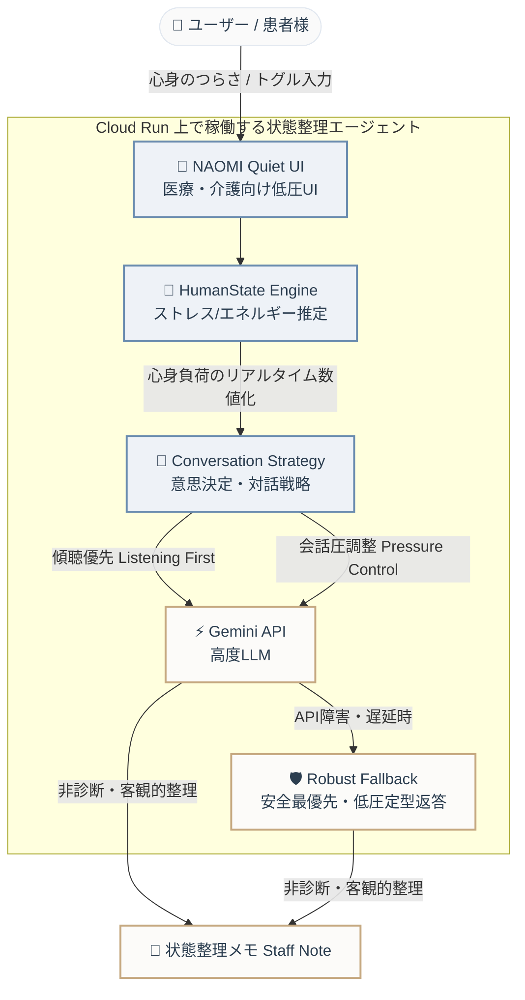

# 🌿 NAOMI 状態適応型アーキテクチャ概要 (ハッカソン提出用)

審査員が数秒で**「一般的なAIチャットボットと異なり、相手の状態に合わせて対話圧を調整する Human-Adaptive Agent である」**という本質的価値を直感的に理解できるよう、美観とシンプルさを両立した1枚のアーキテクチャに整理しました。

---

## 📸 ハッカソン提出向けビジュアル・アーキテクチャ
Quiet Luxury（静かな贅沢）および Cognitive Relief（認知的負荷の解放）を体現する、和モダンで上質なダイアグラムです。

---

## 🗺️ コア・システムフロー (1枚絵)

---

## ⚡ 審査員の心を掴む 3つのコア要素

1. **HumanState Engine × Conversation Strategy**
   入力された言語のみならず、言葉の乱れや疲労度から「ストレス度」と「精神的エネルギー」を推定し、会話圧（Pressure Control：返答の量やトーン）を自動制御します。
2. **Listening First（傾聴最優先）**
   一般的なAIのようにすぐ解決策やタスク（指示）を突きつけるのではなく、まずは低い会話圧で受け止め、心身に小さな余白を作る「Cognitive Relief（認知的解放）」をもたらします。
3. **安全第一の「非診断AI」と Robust Fallback**
   病名診断や医療診断は一切行わず、客観的な「状態整理」のみを支援。Gemini APIの障害やタイムアウト時でも、ローカルルールに基づいた超安全な **Robust Fallback** で対話を崩さず、確実に医療スタッフへ引き継ぐメモ（Staff Note）を成立させます。
